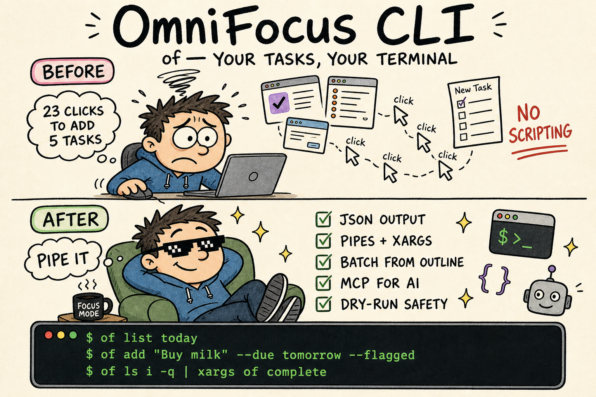

# OmniFocus CLI (`of`)

(unofficial) **The Command-Line Bridge for OmniFocus 4 on macOS.**

`of` is a fast, scriptable command-line interface that brings your OmniFocus tasks, projects, and GTD workflows to the terminal.

---



## 💡 The Problem

OmniFocus is the gold standard for GTD on Apple platforms, but scripting it has always been painful:

1. **AppleScript Overhead:** Each command spawns a new scripting process, making batch operations slow.
2. **No CLI Native:** Power users who live in the terminal must context-switch to the GUI for task management.
3. **Pipeline Unfriendly:** OmniFocus doesn't integrate well with Unix tools (`grep`, `xargs`, `jq`, etc.).

## 🚀 The Solution

`of` wraps optimized JXA (JavaScript for Automation) scripts with a modern Node.js CLI, giving you:

- **Fast queries:** List inbox, today, flagged, projects, and more in milliseconds
- **Unix-friendly output:** JSON and quiet modes for scripting
- **Bulk operations:** Pipe task lists to add, complete, or modify
- **Dry-run safety:** Preview changes before committing

---

## 🛠 Installation

```bash
# Clone or download this repository
cd omnifocus-cli

# Install dependencies
bun install

# Link globally (makes 'of' available everywhere)
bun link
```

**Requirements:**
- macOS (OmniFocus 4 installed)
- Node.js 18+ or Bun

---

## ⚡ Quick Start

```bash
# List your inbox
of list inbox

# Today's tasks
of list today

# Add a quick task
of add "Buy milk"

# Add task with options
of add "Review proposal" --project "Work" --due tomorrow --flagged

# Complete a task
of complete <task-id>

# Search for tasks
of search "meeting"

# Trigger sync
of sync
```

---

## 📖 Commands

### Listing

| Command | Description |
|---------|-------------|
| `of list inbox` | Inbox tasks |
| `of list today` | Due or available today |
| `of list flagged` | Flagged tasks |
| `of list projects` | Active projects |
| `of list folders` | Folder hierarchy |
| `of list tags` | All tags |
| `of list forecast` | Next 7 days (or `--days N`) |

**Common flags:** `--json`, `--pretty`, `--quiet` (IDs only), `--limit N`, `--all` (include completed)

### Adding

```bash
# Single task
of add "Task name" --project "Project" --due tomorrow --tag "Context"

# Quick add (inbox only)
of quick "Fast task" --flagged

# New project with tasks
of add project "New Website" --folder "Work" --tasks "Design,Build,Deploy"

# Bulk from stdin
cat tasks.txt | of add --project "Inbox Processing"

# Batch projects from outline
cat outline.md | of add batch --folder "Q1 Goals"
```

### Modifying

Date flags accept `today`, `tomorrow`, `yesterday`, relative offsets `±N` with
`d`/`w`/`m`/`y` units (`+3d`, `-2w`, `+1m`, `-1y`), or ISO dates.

```bash
# Update task
of modify <task-id> --due "+3d" --flagged

# Move task to project
of modify <task-id> --project "Different Project"

# Reorder tasks within a project
of modify <task-id> --order 0  # Move to first position

# Update project
of project modify <id> --status on-hold
```

### Completing

```bash
# Complete task
of complete <task-id>

# Backdate the completion (work finished earlier)
of complete <task-id> --on -2d
of complete <task-id> --on yesterday

# Drop task (mark abandoned)
of drop <task-id>

# Delete task permanently
of delete <task-id>

# Bulk complete from stdin
of list inbox -q | xargs -I {} of complete {}
```

### Organization

```bash
# Create folder
of folder add "New Folder"

# Create tag
of tag add "New Tag"

# Move project to folder
of project move <project-id> --folder "Work"

# Delete a project permanently (refuses non-empty projects without --force)
of project delete "Old Project" --dry-run   # preview what it holds
of project delete "Old Project" --force     # delete it and its tasks

# Delete a folder (same non-empty guard)
of folder delete "Old Folder" --force

# Review projects needing review
of review
```

### Utilities

```bash
# Trigger OmniFocus sync
of sync

# Get task details
of get task <id>

# Search tasks
of search "keyword" --limit 20

# Generate shell completions
of completion bash >> ~/.bashrc
of completion zsh >> ~/.zshrc
```

### MCP Server

```bash
# Start MCP server (stdio transport)
of mcp run

# Show MCP configuration info
of mcp info
```

---

## 🔧 Output Modes

All commands support multiple output formats:

```bash
# Human-readable (default)
of list inbox

# JSON for scripting
of list inbox --json

# Pretty JSON
of list inbox --json --pretty

# IDs only (for piping)
of list inbox -q
```

---

## 🏗 Architecture

```
omnifocus-cli/
├── bin/of.js           # CLI entry point
├── src/
│   ├── index.js        # Command registration
│   ├── jxa-runner.js   # JXA execution bridge
│   ├── output.js       # Output formatting
│   ├── commands/       # Command handlers
│   └── mcp/
│       └── server.js   # MCP server implementation
└── jxa/
    ├── read/           # Query scripts
    ├── write/          # Mutation scripts
    └── utils/          # Shared helpers
```

The CLI spawns `osascript -l JavaScript` to execute JXA scripts that communicate with OmniFocus via the macOS scripting bridge. The MCP server wraps these same JXA scripts to expose them as tools for AI assistants.

### Automation APIs: JXA and OmniJS

OmniFocus exposes two automation surfaces, and this project deliberately uses the older-looking one.

- **JXA** (JavaScript for Automation) drives the app through Apple Events and the scripting dictionary. Every property read is an inter-process round trip.
- **OmniJS** (Omni Automation) is Omni's modern API. Scripts run *inside* OmniFocus, reached from JXA via `Application("OmniFocus").evaluateJavascript(source)` — so it is a payload delivered over the same bridge, not an alternative to it.

The intuitive conclusion is that OmniJS should win, because its loop runs in-process. Measured on a real database (827 tasks, identical logic, identical output), it does not:

| Approach | Time |
|---|---|
| **JXA, bulk property fetch** | **0.21s** |
| OmniJS via `evaluateJavascript` | 1.78s |
| JXA, one Apple Event per property per task | 19.3s |

Breaking down where OmniJS spends its time:

| Step | Time |
|---|---|
| `osascript` + connect to app | 0.03s |
| `evaluateJavascript` with an empty body | 0.20s |
| OmniJS reading `flattenedTasks.length` and nothing else | 1.1–1.8s |
| OmniJS looping all 827 tasks | 1.78s |

Materializing the task collection inside OmniJS is nearly the entire cost; the loop that follows is almost free. JXA's bulk path never materializes objects at all — it asks OmniFocus for whole-collection arrays of primitives:

```javascript
// One Apple Event per property, for every task at once — not per task.
const ids = collection.id(), names = collection.name(), due = collection.effectiveDueDate();
```

That single pattern is the difference between 0.21s and 19.3s. It is implemented in `formatTasksBulk` / `formatTasksBriefBulk` in `jxa/utils/helpers.js`, and every list reader goes through it. **If you add a read path, fetch by collection, never per task.**

#### Neither API is a superset

The two dictionaries have complementary gaps, so "just use OmniJS" is not available even where it would be faster:

| | OmniJS | JXA |
|---|---|---|
| `effectiveDueDate`, `effectiveDeferDate` | ✅ | ✅ |
| `plannedDate`, `effectivePlannedDate` | ✅ | ✅ |
| `effectiveFlagged` | ✅ | ❌ |
| Full task status enum | ✅ `Task.Status` | ⚠️ `blocked` / `next` booleans |
| `effectivelyCompleted`, `effectivelyDropped` | ❌ | ✅ |
| `synchronize()` | ❌ | ✅ |

Two consequences show up in this codebase:

- **Sync must be JXA.** The OmniJS sandbox exposes no sync method, so `jxa/write/sync.js` calls `app.synchronize(doc)` directly.
- **Flag inheritance has no JXA property.** OmniFocus's Flagged perspective shows a task when it is flagged *or* inherits a flag from its project *or* from an ancestor task, and JXA has no `effectiveFlagged`. Rather than drop into OmniJS, `effectiveFlagsBulk` in `jxa/utils/helpers.js` resolves that closure from three bulk arrays (`flagged`, `containingProject.flagged`, `parentTask.id`). It returns exactly the same set as OmniJS `effectiveFlagged`, in 0.25s versus 0.66s.

Note the exclusion filter in that helper: it keys off `effectivelyCompleted` / `effectivelyDropped`, not the own properties. A live task inside a dropped project has `dropped === false` but `effectivelyDropped === true`, and filtering on the own property leaks it into results.

#### When to reach for OmniJS

Use JXA bulk fetch by default. Reach for `evaluateJavascript` only when:

1. JXA cannot express the data at all *and* no closure over bulk arrays reconstructs it, or
2. you are performing many mutations at once, where one in-process script may beat N Apple Events. This case is **untested here** — the measurements above cover reads only.

Benchmark before switching. These numbers come from one database on one machine, and OmniJS timings varied between 0.66s and 1.89s across runs; treat them as indicative, and measure your own case rather than assuming either API wins.

---

## 💻 Examples

### Daily Review Script

```bash
#!/bin/bash
echo "=== Today's Focus ==="
of list today --limit 5

echo -e "\n=== Flagged Items ==="
of list flagged --limit 5

echo -e "\n=== Inbox Count ==="
of list inbox -q | wc -l | xargs echo "Items in inbox:"
```

### Process Inbox to Project

```bash
# Move all inbox items to a project
of list inbox -q | while read id; do
  of modify "$id" --project "Processing"
done
```

### Bulk Add from File

```bash
# tasks.txt (one per line)
# Review Q4 report
# Schedule team meeting
# Update documentation

cat tasks.txt | of add --project "Work" --due "+1w"
```

### Create Project Structure

```bash
# outline.md
# - Website Redesign
#   - Research competitors
#   - Create wireframes
#   - Build prototype
# - Marketing Campaign
#   - Draft copy
#   - Design assets

cat outline.md | of add batch --folder "2026 Projects"
```

---

## 🤖 MCP Server

`of` includes a built-in [Model Context Protocol](https://modelcontextprotocol.io) server, enabling AI assistants (Claude, etc.) to manage OmniFocus directly.

### Setup

Add to your Claude Code config (`~/.claude/settings.json`):

```json
{
  "mcpServers": {
    "omnifocus": {
      "command": "of",
      "args": ["mcp", "run"]
    }
  }
}
```

Or with full path:

```json
{
  "mcpServers": {
    "omnifocus": {
      "command": "node",
      "args": ["/path/to/omnifocus-cli/bin/of.js", "mcp", "run"]
    }
  }
}
```

### Available Tools (5 consolidated)

| Tool | Actions | Description |
|------|---------|-------------|
| `omnifocus_task` | list, get, create, update, complete, drop, delete | Full task CRUD with inbox/today/flagged/forecast/search views |
| `omnifocus_project` | list, get, get_tasks, create, update, complete, drop, set_status | Project management and lifecycle |
| `omnifocus_folder` | list, create, update, move_project | Folder organization |
| `omnifocus_tag` | list, get_tasks, create, update, delete | Tag management |
| `omnifocus_util` | sync, review_list, mark_reviewed, status | Utilities and review workflow |

Each tool uses an `action` parameter to select the operation. This consolidated design minimizes token overhead while providing full OmniFocus access.

### Example Prompts

Once configured, you can ask Claude things like:

- "What's in my OmniFocus inbox?"
- "Create a task to call Mom tomorrow"
- "Show me all flagged tasks"
- "Add a project called 'Website Redesign' with tasks for design, development, and testing"
- "Mark task ABC123 as complete"

---

## 🗺 Roadmap

- [x] **Phase 1:** CLI tool with full read/write OmniFocus access
- [x] **Phase 2:** MCP Server for AI assistant integration

---

## 📄 License

MIT

**Created by Ian Shen (@2b3pro)** — [Buy me a coffee or two](https://paypal.me/2b3/10) ☕
